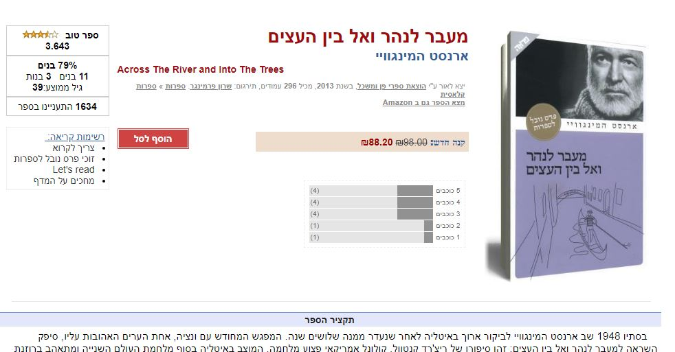
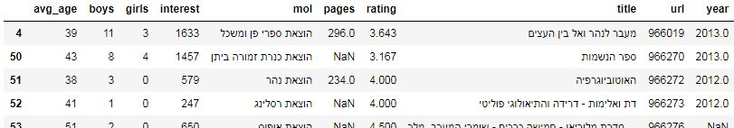
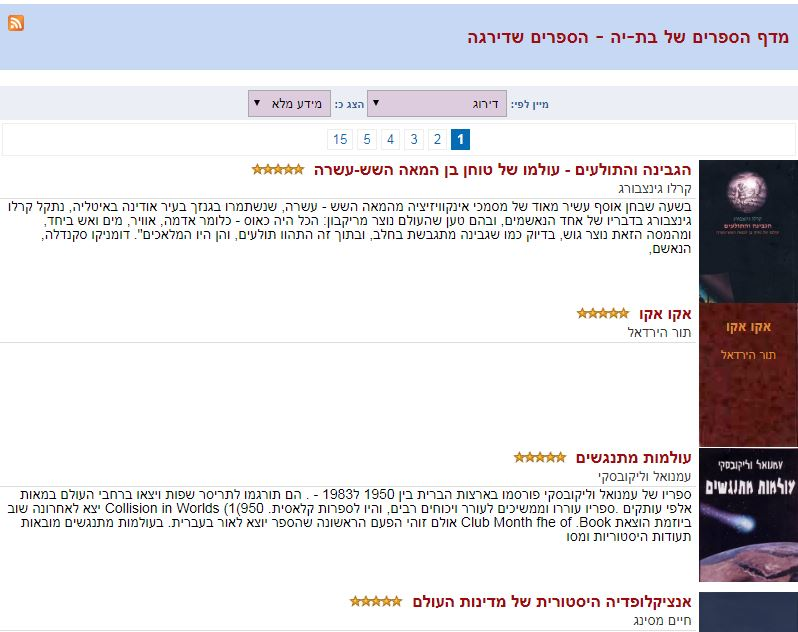
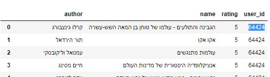

# books-recommender
scrape books data from simania and simple books recommender and user based recommender

## first file : simania 

the first file is the scraper - gets books data from www.simania.co.il

and loads the data into csv file ( only for books with more than 1 review)

## source : 

  

## as a row in the dataframe :

  

## second file : recommender 

simple recommender (without users data)

based on weighted rating and optional variables like under 200 pages book , specific author and more . 

returns the top rated (weighted rating) N books.

## 3rd file : user data scraper 

we can find how users rated books

  

scraped and inserted into dataframe 

  

## 4rd file : user data based recommender - Collaborative filtering

using ML  Nearest Neighbor Model 

ref : https://beckernick.github.io/music_recommender/
